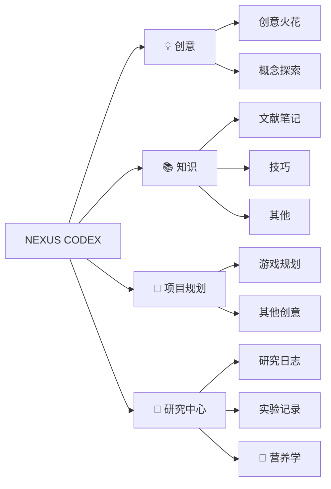

---
{"publish":true,"title":"🌌 NEXUS CODEX | 知识宝库","created":"2025-07-02","modified":"2025-07-02","cssclasses":""}
---

> *"知识的真正力量不在于死板地拥有多少，而在于灵活地连接运用起来。" — 我*

## 🔮 欢迎来到我的数字大脑

这是我的 **Obsidian 知识库**，一个不断完善的思想网络，储存着我的研究、项目、灵感和思考。这里不仅仅是信息的集合，更是我个人知识管理系统的核心 — 一个活跃的、有机的思想生态系统。

当然，在这个仓库里的只是公开的一小部分
目前公开的内容有：
营养学：[[研究中心/营养学/营养补充规划\|营养补充规划]]

## ✨ 核心理念

- **连接胜于收集**：知识点之间的联系往往比知识本身更有价值
- **原子化笔记**：保持每个笔记聚焦于单一概念，便于重组和连接
- **渐进式总结**：从碎片到系统，逐步构建知识体系
- **双向链接**：通过关联创造新的见解和发现
- **持续迭代**：知识不是静态的，而是不断演化的

## 🗺️ 导航指南

## 📂 仓库结构

### 💡 创意实验室
存放灵感闪现、未成形的想法和创意实验。这里是思想的游乐场，没有判断，只有可能性。

### 📚 知识花园
我的核心知识库，按主题组织的笔记、文献摘要和概念连接。这里的内容经过精心培育，随时间生长和演化。

### 🚀 项目指挥部
所有进行中和计划中项目的中央控制台。包含项目计划、里程碑追踪和资源分配。

### 🧠 研究中心
深度研究区域，包含实验记录、数据分析和研究日志。这里是探索未知的前沿。

## ⚙️ 核心工作流

1. **捕获** → 快速记录所有想法和灵感到 :LiLightbulb:创意
2. **处理** → 定期整理 :LiLightbulb:创意 ，提炼为 :LiRocket:项目规划
3. **连接** → 利用关系图谱建立笔记之间的关联，寻找模式和洞见
4. **创造** → 基于连接的网络产生新的想法和项目
5. **回顾** → 定期审视和更新知识网络

## 🧩 关键插件

- **Dataview**: 数据可视化和查询
- **Kanban**: 项目和任务管理
- **Calendar**: 时间管理和日记导航
- **Graph Analysis**: 知识网络分析
- **Templater**: 高级模板系统
- **Spaced Repetition**: 间隔重复学习

## 🔥 使用技巧

- 使用 `[[双向链接]]` 连接相关概念
- 用 `#标签` 进行横向分类
- 创建 [[知识/技巧/Obsidian 高级技巧详解#MOC (Map of Content) 作为主题导航\|MOC (Map of Content)]] 作为主题导航
- 使用 [[知识/技巧/Obsidian 高级技巧详解#YAML 前置元数据增强笔记属性\|YAML 前置元数据]] 增强笔记属性

## 🌱 持续发展计划

- [ ] 完善知识分类体系
- [ ] 建立更系统的复习机制
- [ ] 优化项目管理流程
- [ ] 增强数据可视化能力
- [ ] 开发个人知识管理方法论

---

> *此知识库是我思想的数字延伸，一个不断成长的思维宇宙。等将来有一天如果能接入AI系统与脑机，它将是我的外部大脑，也是我的创意引擎和研究伙伴。*
